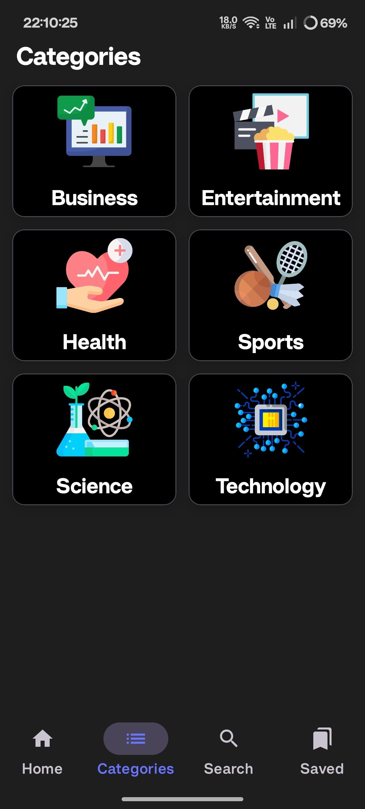
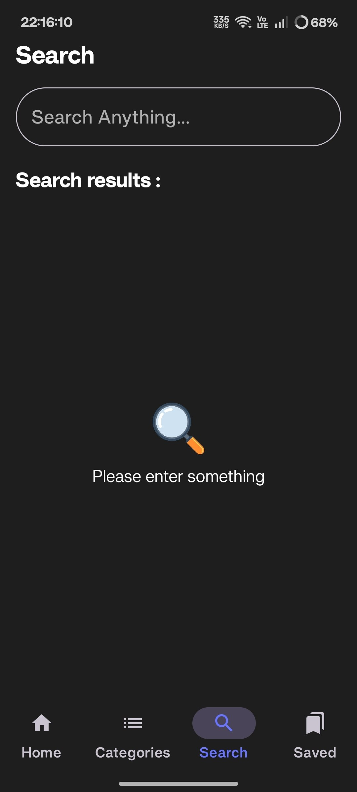
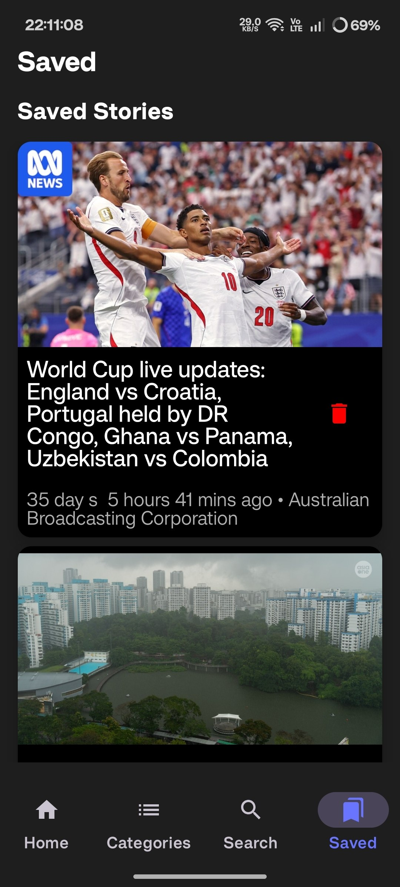

# 📰 InBrief

A modern Android news application built with **Kotlin** and **Jetpack Compose**, following **MVVM + Clean Architecture** principles. The app delivers the latest news from multiple categories while supporting offline reading through local storage.

---

## 📱 Features

- 📰 Latest news headlines
- 🔍 Search news articles
- 📂 Browse news by category
- ❤️ Save favorite articles for offline reading
- 🌐 Fetch news from REST APIs
- 📶 Offline-first experience using Room Database
- ⚡ Reactive UI with Kotlin Flow
- 🎨 Modern Material 3 UI
- 🧭 Navigation Compose
- 💉 Dependency Injection using Hilt

---

## 📸 Screenshots

| Home | Categories |
|------|------------|
|  |  |

| Search | Saved |
|------|------|
|  |  |

| Article Details | Dark Theme |
|------|------|
|  |  |

---

# 🏗 Architecture

The project follows **MVVM + Clean Architecture**.

```
Presentation
│
├── UI (Jetpack Compose)
├── ViewModel
│
Domain
│
├── models
├── Repository Interfaces
│
Data
│
├── Remote (Retrofit)
├── Local (Room Database)
├── Repository Implementation
│
Core
│
├── Dependency Injection
├── Utilities
└── Common Classes
```

---

# 🛠 Tech Stack

- Kotlin
- Jetpack Compose
- Material 3
- MVVM Architecture
- Clean Architecture
- Coroutines
- Kotlin Flow
- StateFlow
- Hilt
- Retrofit
- OkHttp
- Gson
- Room Database
- DataStore
- Navigation Compose
- Coil
- Gradle Version Catalog

---

# 📂 Project Structure

```
com.arjuna.inbrief
│
├── data
│   ├── local
│   ├── remote
│   ├── repository
│
├── domain
│   ├── repository
│   └── model
│
├── presentation
│   ├── screens
│   ├── components
│   ├── navigation
│   └── viewmodel
│
├── di
├── common
└── InBriefApplication.kt
```

---

# 🚀 Getting Started

### Clone the repository

```bash
git clone https://github.com/arjuna-b/InBrief.git
```

### Open in Android Studio

Use the latest stable version of Android Studio.

### Configure API Key

Create a `local.properties` file in the project root.

```properties
NEWS_API_KEY=YOUR_API_KEY
```

Or update the API key wherever it is referenced in the project.

---

# 📦 Libraries Used

| Library | Purpose |
|---------|---------|
| Jetpack Compose | Modern Android UI |
| Hilt | Dependency Injection |
| Retrofit | REST API Client |
| OkHttp | Network Layer |
| Gson | JSON Parsing |
| Room | Local Database |
| Kotlin Coroutines | Asynchronous Programming |
| Kotlin Flow | Reactive Streams |
| Navigation Compose | Navigation |
| Coil | Image Loading |

---

# 🎯 Key Highlights

- Clean and scalable architecture
- Lifecycle-aware state management
- Reactive programming with Flow
- Offline article storage
- Material Design 3 UI
- Modular and maintainable codebase

---

# 📖 Future Improvements

- Pagination
- Multiple news providers
- Bookmark synchronization
- Unit testing
- UI testing
- Tablet support

---

# 👨‍💻 Author

**Arjuna Batchu**

Android Developer

- LinkedIn: https://www.linkedin.com/in/arjuna-babu-batchu-37a53b226
- GitHub: https://github.com/arjuna-b

---

## ⭐ If you found this project helpful, consider giving it a star!
